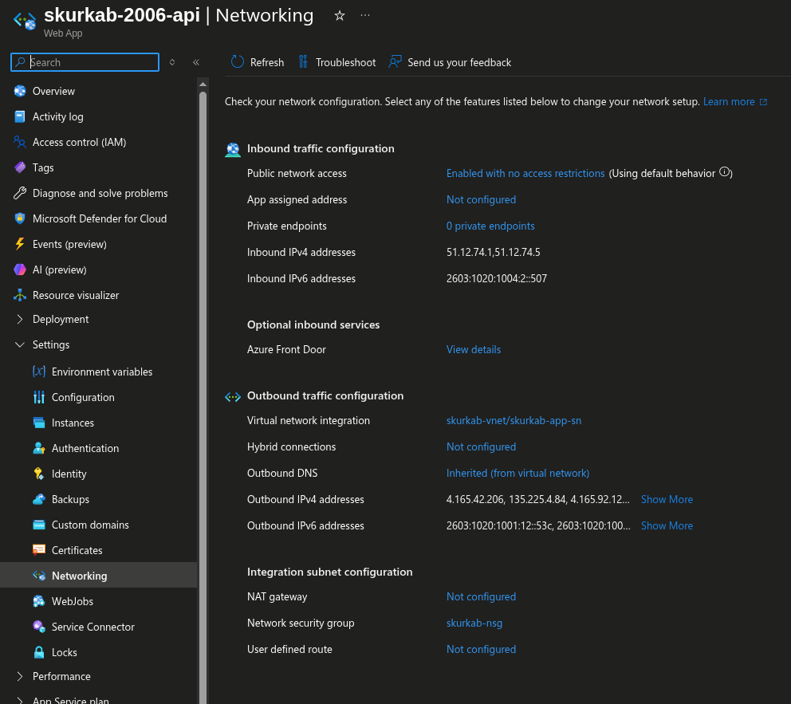
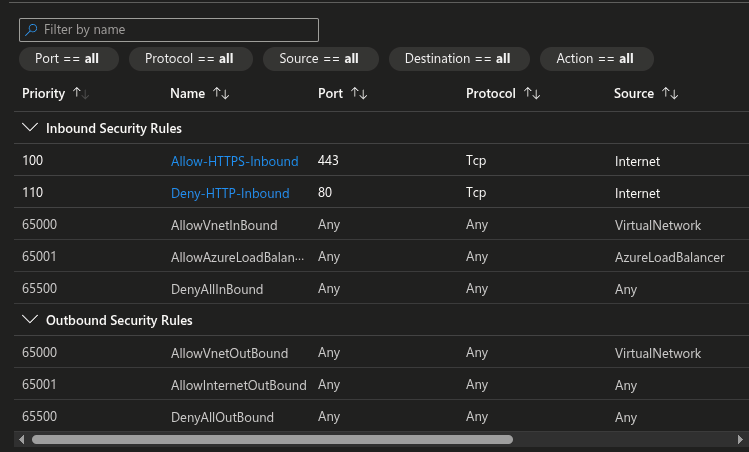
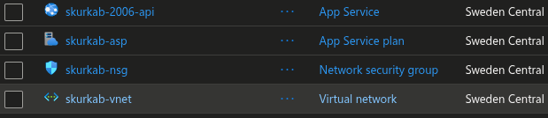
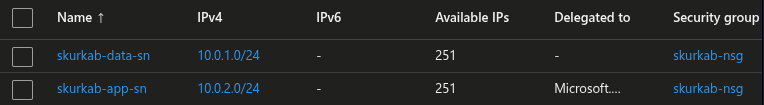

# skurkab

This README documents the Azure networking and application setup for the skurkab project.

## 1. Create resource group

```bash
$ az group create -n skurkab-rg -l northeurope
```

```text
Location     Name
-----------  ----------
northeurope  skurkab-rg
```

## 2. Create network security group

```bash
$ az network nsg create \
    --resource-group skurkab-rg \
    --name skurkab-nsg
```

## 3. Create virtual network and data subnet

```bash
$ az network vnet create \
    --resource-group skurkab-rg \
    --name skurkab-vnet \
    --address-prefix 10.0.0.0/16 \
    --subnet-name skurkab-data-sn \
    --subnet-prefix 10.0.1.0/24
```

## 4. Create app subnet and attach the NSG

```bash
$ az network vnet subnet create \
    --resource-group skurkab-rg \
    --vnet-name skurkab-vnet \
    --address-prefix 10.0.0.0/16 \
    --name skurkab-app-sn \
    --address-prefixes 10.0.2.0/24 \
    --network-security-group skurkab-nsg \
    --delegations Microsoft.Web/serverFarms
```

```text
AddressPrefix    Name            PrivateEndpointNetworkPolicies    PrivateLinkServiceNetworkPolicies    ProvisioningState    ResourceGroup
---------------  --------------  --------------------------------  -----------------------------------  -------------------  ---------------
10.0.2.0/24      skurkab-app-sn  Disabled                          Enabled                              Succeeded            skurkab-rg
```

## 5. Allow HTTPS inbound traffic

```bash
$ az network nsg rule create \
    --resource-group skurkab-rg \
    --nsg-name skurkab-nsg \
    --name Allow-HTTPS-Inbound \
    --priority 100 \
    --source-address-prefixes Internet \
    --destination-port-ranges 443 \
    --destination-address-prefixes 10.0.2.0/24 \
    --access Allow \
    --protocol Tcp \
    --direction Inbound
```

```text
Access    DestinationAddressPrefix    DestinationPortRange    Direction    Name                 Priority    Protocol    ProvisioningState    ResourceGroup    SourceAddressPrefix    SourcePortRange
--------  --------------------------  ----------------------  -----------  -------------------  ----------  ----------  -------------------  ---------------  ---------------------  -----------------
Allow     10.0.2.0/24                 443                     Inbound      Allow-HTTPS-Inbound  100         Tcp         Succeeded            skurkab-rg       Internet               *
```

## 6. Deny HTTP inbound traffic

```bash
$ az network nsg rule create \
    --resource-group skurkab-rg \
    --nsg-name skurkab-nsg \
    --name Deny-HTTP-Inbound \
    --priority 110 \
    --description "Deny HTTP inbound traffic" \
    --source-address-prefixes Internet \
    --destination-port-ranges 80 \
    --destination-address-prefixes "*" \
    --access Deny \
    --protocol Tcp \
    --direction Inbound
```

```text
Access    DestinationAddressPrefix    DestinationPortRange    Direction    Name               Priority    Protocol    ProvisioningState    ResourceGroup    SourceAddressPrefix    SourcePortRange
--------  --------------------------  ----------------------  -----------  -----------------  ----------  ----------  -------------------  ---------------  ---------------------  -----------------
Deny      *                           80                      Inbound      Deny-HTTP-Inbound  110         Tcp         Succeeded            skurkab-rg       Internet               *
```

## 7. Create app service plan

```bash
$ az appservice plan create \
    --resource-group skurkab-rg \
    --name skurkab-asp \
    --sku B1 \
    --location swedencentral \
    --is-linux
```

```text
Creating App Service Plan 'skurkab-asp' (Linux).
AsyncScalingEnabled    ElasticScaleEnabled    FreeOfferExpirationTime    GeoRegion       HyperV    IsCustomMode    IsSpot    IsXenon    Kind    Location       MaximumElasticWorkerCount    MaximumNumberOfWorkers    Name         NumberOfSites    NumberOfWorkers    PerSiteScaling    ProvisioningState    Reserved    ResourceGroup    Status    Subscription                          TargetWorkerCount    TargetWorkerSizeId    ZoneRedundant
---------------------  ---------------------  -------------------------  --------------  --------  --------------  --------  ---------  ------  -------------  ---------------------------  ------------------------  -----------  ---------------  -----------------  ----------------  -------------------  ----------  ---------------  --------  ------------------------------------  -------------------  --------------------  ---------------
False                  False                  2026-09-30T14:24:35.69     Sweden Central  False     False           False     False      linux   swedencentral  1                            0                         skurkab-asp  0                1                  False             Succeeded            True        skurkab-rg       Ready     00000000-0000-0000-0000-000000000000  0                    0                     False
```

## 8. Create app service

```bash
$ az webapp create \
    --resource-group skurkab-rg \
    --plan skurkab-asp \
    --name skurkab-$RANDOM-api \
    --runtime "DOTNETCORE|10.0" \
    --https-only true \
    --vnet skurkab-vnet \
    --subnet skurkab-app-sn
```

```text
Webapp 'skurkab-2006-api' created. Deploy your code with: az webapp deploy
AvailabilityState    ClientAffinityEnabled    ClientAffinityProxyEnabled    ClientCertEnabled    ClientCertMode    ContainerSize    CustomDomainVerificationId       DailyMemoryTimeQuota    DefaultHostName                     Enabled    EndToEndEncryptionEnabled    HostNamesDisabled    HttpsOnly    HyperV    IpMode    IsXenon    KeyVaultReferenceIdentity    Kind       LastModifiedTimeUtc         Location        Name              OutboundIpAddresses       PossibleOutboundIpAddresses  PublicNetworkAccess    RedundancyMode    RepositorySiteName    Reserved    ResourceGroup   ScmSiteAlsoStopped    ServerFarmId                                                                                                                     Sku    State    StorageAccountRequired    UsageState
-------------------  -----------------------  ----------------------------  -------------------  ----------------  ---------------  -------------------------------  ----------------------  ----------------------------------  ---------  ---------------------------  -------------------  -----------  --------  --------  ---------  ---------------------------  ---------  --------------------------  --------------  ----------------  ------------------------  ---------------------------  ---------------------  ----------------  --------------------  ----------  --------------  --------------------  -------------------------------------------------------------------------------------------------------------------------------  -----  -------  ------------------------  ------------
Normal               True                     False                         False                Required          0                FFFFFFFFFFFFFFFFFFFFFFFFFFFF...  0                       skurkab-2006-api.azurewebsites.net  True       False                        False                True         False     IPv4      False      SystemAssigned               app,linux  2026-08-31T16:59:56.573333  Sweden Central  skurkab-2006-api  x.xxx.xx.xxx,xxx.xxx.x.xx  x.xxx.xx.xxx,xxx.xxx.x.xx   Enabled                None              skurkab-2006-api      True        skurkab-rg      False                 /subscriptions/00000000-0000-0000-0000-000000000000/resourceGroups/skurkab-rg/providers/Microsoft.Web/serverfarms/skurkab-asp    Basic  Running  False                     Normal
```

## 9. Deploy with GitHub Actions

### Create distribution identity and assign role to app service
```bash
sub_id=$(az account show --query id -o tsv)
tenant_id=$(az account show --query tenantId -o tsv)

deploy_app_id=$(az ad app create --display-name "GitHubActions-Deploy" --query appId -o tsv)
deploy_obj_id=$(az ad app show --id $deploy_app_id --query id -o tsv)
deploy_sp_id=$(az ad sp create --id $deploy_app_id --query id -o tsv)

az role assignment create \
    --assignee-object-id $deploy_sp_id \
    --assignee-principal-type ServicePrincipal \
    --role Contributor \
    --scope /subscriptions/$sub_id/resourceGroups/skurkab-rg

```

```text
Verified GitHub repo and branch
Getting workflow template using runtime: DOTNETCORE|10.0
Filling workflow template with name: skurkab-2006-api, branch: main, version: 10.x, slot: production
Creating new workflow file: .github/workflows/main_skurkab-2006-api.yml
Adding publish profile to GitHub
Fetching publish profile with secrets for the app 'skurkab-2006-api'
Result
------------------------------------------------
https://github.com/baleygr-ofnir/skurkab/actions
```

### Create federated credential for GitHub Actions
```bash 
cat<<EOF > credentials.json
{
  "name": "GitHub-OIDC-Main",
  "issuer": "https://token.actions.githubusercontent.com",
  "subject": "repo:baleygr-ofnir/skurkab:ref:refs/heads/main",
  "audiences": ["api://AzureADTokenExchange"],
}

az ad app federated-credential create \
    --id $deploy_obj_id \
    --parameters @credentials.json
```

```text
az ad app federated-credential create --id $deploy_obj_id --parameters @credentials.json              
@odata.context                                                                                                                        Issuer                                       Name              Subject
------------------------------------------------------------------------------------------------------------------------------------  -------------------------------------------  ----------------  ----------------------------------------------
https://graph.microsoft.com/v1.0/$metadata#applications('000000000-0000-0000-0000-000000000000')/federatedIdentityCredentials/$entity  https://token.actions.githubusercontent.com  GitHub-OIDC-Main  repo:baleygr-ofnir/skurkab:ref:refs/heads/main
```

### Set GitHub secrets for the app service
```bash
gh secret set AZURE_CLIENT_ID --body $deploy_app_id --repo baleygr-ofnir/skurkab
gh secret set AZURE_TENANT_ID --body $tenant_id --repo baleygr-ofnir/skurkab
gh secret set AZURE_SUBSCRIPTION_ID --body $sub_id --repo baleygr-ofnir/skurkab
```

### Add permissions and login to workflow
- Under build-and-deploy > runs-on block
```yaml
permissions:
  id-token: write
  contents: read
```
- Before Deploy to Azure Web App block
```yaml
- name: 'Azure Login'
  uses: azure/login@v2
  with:
    client-id: ${{ secrets.AZURE_CLIENT_ID }}
    tenant-id: ${{ secrets.AZURE_TENANT_ID }}
    subscription-id: ${{ secrets.AZURE_SUBSCRIPTION_ID }}
```

---

## Entra ID & RBAC Limitations (School Account Policy)

### 1. Encountered Blockers

Due to strict administrator policies on the provided school Azure account, access to **Microsoft Entra ID** is entirely restricted. Navigating to the Entra ID overview yields a `401 Insufficient privileges` error (see attached `image_7163c2.png`).

Because of this tenant-level restriction, the following mandatory steps could not be executed:

* Creating the four required Entra ID test users (Praktikant, Mellanchef, Konsultchef, Admin).
* Creating an App Registration and Service Principal for the API.
* Defining and assigning Custom App Roles.
* Configuring App Service Authentication (Easy Auth) to validate tokens against the tenant.

### 2. Proposed Implementation (How it would have been done)

If the account had the necessary permissions (e.g., Global Administrator or Privileged Role Administrator), the identity and access management would have been provisioned using the following Azure CLI sequence.

**Creating Users and Assigning Azure RBAC (Reader):**

```bash
DOMAIN="yourname.onmicrosoft.com"
RG_NAME="SkurkAB-RG"

# Create User
PRAKTIKANT_ID=$(az ad user create \
    --display-name "Praktikant" \
    --password "StrongPass123!" \
    --user-principal-name "praktikant@$DOMAIN" \
    --query id -o tsv)

# Assign Azure RBAC Reader role to the Resource Group
az role assignment create \
    --assignee $PRAKTIKANT_ID \
    --role "Reader" \
    --resource-group $RG_NAME

```

*(This process would be repeated for the remaining three roles).*

**Provisioning App Registration and App Roles:**

```bash
# Create App Registration and Service Principal
APP_ID=$(az ad app create --display-name "SkurkAB-App" --query appId -o tsv)
OBJ_ID=$(az ad app show --id $APP_ID --query id -o tsv)
SP_ID=$(az ad sp create --id $APP_ID --query id -o tsv)

# Apply App Roles via JSON manifest
az ad app update --id $OBJ_ID --app-roles @app-roles.json

```

**Assigning App Roles to Users and Enabling Easy Auth:**

```bash
# Example: Assigning 'Praktikant' role (requires Graph API)
ROLE_ID="11111111-1111-1111-1111-111111111111"
az rest --method post \
    --url "https://graph.microsoft.com/v1.0/servicePrincipals/$SP_ID/appRoleAssignedTo" \
    --body "{\"principalId\": \"$PRAKTIKANT_ID\", \"resourceId\": \"$SP_ID\", \"appRoleId\": \"$ROLE_ID\"}"

# Enable Easy Auth on the App Service
TENANT_ID=$(az account show --query tenantId -o tsv)
az webapp auth update --resource-group $RG_NAME --name $APP_NAME --enabled true --action Return401
az webapp auth microsoft update --resource-group $RG_NAME --name $APP_NAME --client-id $APP_ID --tenant-id $TENANT_ID

```

### 3. Relevance to Security Architecture

The inability to configure Entra ID directly impacts the implementation of **Zero Trust**.

Without these configurations, the API relies solely on network-level security (VNet/NSG). While the NSG successfully blocks unauthorized HTTP traffic and isolates the data subnet, it cannot inspect or verify the identity of the user making an HTTPS request.

Proper identity configuration separates **Authentication** (Easy Auth verifying *who* the user is) from **Authorization** (App Roles determining *what* they are allowed to do with the data). Because these layers are missing, the endpoint restrictions (e.g., preventing a 'Praktikant' from executing a `DELETE` request) cannot be enforced or tested via OAuth tokens in Postman.

---
## Screenshots







